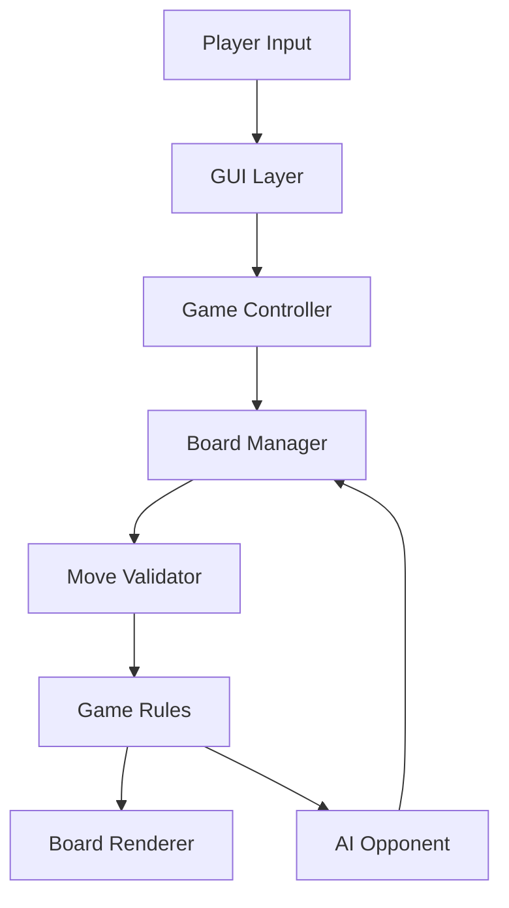

# ♟️ Java Checkers Game


> A modern implementation of the classic Checkers (Draughts) game using Java Swing with intelligent gameplay, clean Object-Oriented Design, and an interactive graphical interface.

---

## ⭐ Overview

Java Checkers Game is a desktop application developed using Java Swing and AWT that recreates the traditional Checkers board game with modern software engineering practices.

The project demonstrates:

- Object-Oriented Programming
- GUI Development
- Event Handling
- Game Logic
- AI Opponent
- State Management
- Undo Operations

It is designed as both a playable desktop game and an educational Java project.

---

# Why this Project?

Many beginner Java games focus only on visuals.

This project focuses equally on:

✔ Software Architecture

✔ Clean OOP Design

✔ User Experience

✔ Maintainable Code

✔ Real Game Rules

✔ Intelligent Computer Player

---

# Features

✅ Player vs Player

✅ Player vs Computer

✅ Interactive Java Swing GUI

✅ Undo Last Move

✅ Move Highlighting

✅ King Promotion

✅ Automatic Capture Detection

✅ Legal Move Validation

✅ Game State Management

✅ Responsive Mouse Controls

✅ Clean Desktop UI

---

# Architecture



---

# Project Structure

```
Java-Checkers-Game/

│

├── src/

│ ├── Checkers.java

│ ├── Board.java

│ ├── GameLogic.java

│ ├── AI.java

│ └── Utils.java

│

├── assets/

│ ├── screenshots/

│ └── banner.png

│

├── docs/

├── tests/

├── examples/

├── README.md

├── LICENSE

└── .gitignore
```

---

# Tech Stack

| Category | Technology |
|------------|------------|
| Language | Java |
| GUI | Swing |
| Graphics | AWT |
| IDE | IntelliJ / Eclipse / NetBeans |
| Paradigm | Object-Oriented Programming |
| Version Control | Git |
| Build Tool | javac |

---

# Screenshots

```
assets/screenshots/gameplay.png

assets/screenshots/menu.png

assets/screenshots/player-vs-computer.png
```

---

# Demo

> 🎥 Demo GIF Here

```
assets/demo.gif
```

---

# Installation

```bash
git clone https://github.com/username/Java-Checkers-Game.git

cd Java-Checkers-Game

javac src/*.java

java Checkers
```

---

# Requirements

- Java JDK 17+
- Git

---

# Environment Variables

No environment variables required.

---

# Run Locally

```bash
git clone <repo>

cd Java-Checkers-Game

javac src/*.java

java Checkers
```

---

# Docker

```bash
docker build -t java-checkers .

docker run java-checkers
```

---

# Usage

Launch the application

↓

Select Game Mode

↓

Choose your move

↓

Capture opponent pieces

↓

Win the game

---

# Game Rules

- Diagonal movement
- Mandatory captures
- King promotion
- Player turns
- Win detection
- Undo support

---

# AI

Current AI:

- Rule-based opponent
- Prioritizes captures
- Random legal move selection

Future:

- Minimax
- Alpha-Beta Pruning
- Difficulty Levels

---

# Performance

| Metric | Value |
|---------|-------|
| Startup | <1 sec |
| Memory | Low |
| Board Size | 8×8 |
| Players | PvP / PvC |

---

# Roadmap

- Better AI

- Multiplayer

- Online Mode

- Sound Effects

- Animations

- Themes

- Save Games

- Difficulty Levels

---

# Known Limitations

- Basic AI

- Desktop only

- No networking

- No save/load

---

# Testing

✔ Manual Testing

✔ Gameplay Validation

✔ Rule Verification

✔ Undo Testing

---

# Deployment

Desktop Java Application

Compatible with:

- Windows

- Linux

- macOS

---

# Security

No external data collection.

Runs completely offline.

---

# Contributing

Contributions are welcome!

Please open an Issue before submitting major changes.

---

# Versioning

Semantic Versioning (SemVer)

---

# FAQ

### Does it support AI?

Yes.

### Can two players play?

Yes.

### Is Undo available?

Yes.

### Is this beginner friendly?

Absolutely.

---

# License

MIT License

---

# Author

G Harshavardhan

AI Engineering Undergraduate

Amrita Vishwa Vidyapeetham

---

# Support

⭐ Star this repository if you found it useful.

🍴 Fork it to contribute.

🐞 Open an Issue for bugs.

---
